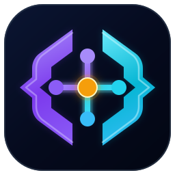
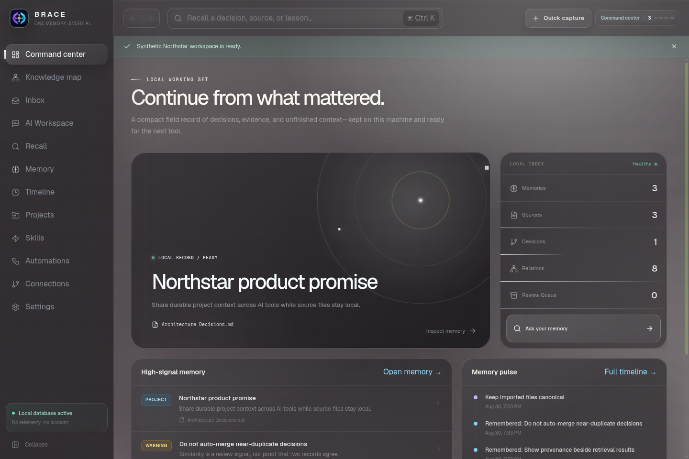
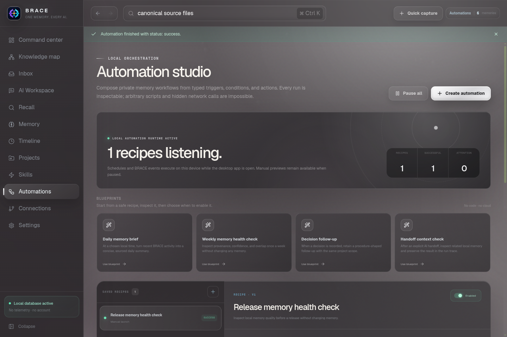
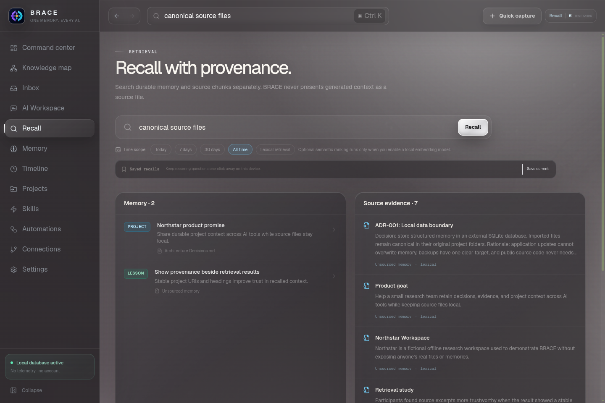

<p align="center">
  
</p>

<h1 align="center">BRACE</h1>

<p align="center"><strong>One memory. Every AI.</strong></p>

<p align="center">
  <a href="https://b-r-a-c-e-brain.vercel.app/">Website</a> ·
  <a href="https://b-r-a-c-e-brain.vercel.app/guide/">Beginner guide</a> ·
  <a href="https://github.com/GYASH28/B.R.A.C.E-brain/releases/tag/v0.5.0">Download 0.5.0</a> ·
  <a href="docs/README.md">Documentation</a>
</p>

[](https://github.com/GYASH28/B.R.A.C.E-brain/actions/workflows/ci.yml)
[](https://github.com/GYASH28/B.R.A.C.E-brain/actions/workflows/codeql.yml)
[](LICENSE)

BRACE is a local-first personal AI memory layer for people who work across multiple AI tools. It turns selected project files, explicit decisions, durable memories, evidence, timelines, and relationships into one provenance-backed store. MCP-compatible clients can recall the same context without a BRACE cloud account or hosted middleman.

> Release status: **0.5.0 preview**. Linux is locally smoke-tested. Windows is built and tested by the repository's native GitHub Actions runner. Packages are not yet code-signed.

| If you want to… | Start here |
| --- | --- |
| Install BRACE | [Windows and Linux downloads](https://b-r-a-c-e-brain.vercel.app/#download) |
| Understand the first run | [Beginner guide](https://b-r-a-c-e-brain.vercel.app/guide/) |
| Connect an AI client | [MCP guide](docs/MCP.md) |
| Understand what stays local | [Privacy model](docs/PRIVACY.md) |
| Contribute safely | [Contributor guide](CONTRIBUTING.md) and [repository map](docs/REPOSITORY_MAP.md) |



## What is implemented

- Structured SQLite memory with migrations, full-text search, evidence, decisions, events, entities, relationships, settings, and skills.
- Durable memory lifecycle: explicit creation, exact deduplication, a persistent near-duplicate review queue, recoverable supersession, retrieval tracking, and content-erasing forget tombstones.
- Durable pinned working context for recurring priorities, plus device-local saved recall questions for repeated investigations.
- Project indexing with heading-aware chunks, incremental hashes, allowlisted text formats, ignored credentials/dependencies/build output, no symlink traversal, and private-path-free provenance URIs.
- Lexical search by default. Semantic and hybrid reciprocal-rank fusion only when a real embedding model returns compatible vectors.
- Optional loopback Ollama embeddings and an advanced HTTPS OpenAI-compatible adapter.
- A real decision timeline and a provenance-backed knowledge graph.
- Five deterministic views over the same graph: **Rings**, **Living**, **Orbit**, **Flow**, and chronological **Chronicle**. Changing a view never changes the underlying memory.
- A triage-focused **Inbox**, an evidence-aware **AI Workspace**, and explicit retention: an answer becomes durable memory only when you choose to retain it.
- Guided, permissioned setup for **Codex CLI**, **Claude Code**, and **Antigravity**, plus exact configuration for any stdio MCP client. BRACE backs up client configuration and verifies its entry before reporting it configured.
- Session continuity through the `brace_memory_compass` prompt and explicit `brace_session_start` / `brace_session_handoff` tools.
- A typed local Automation Studio with schedules and BRACE-event triggers, AND/OR conditions, derived permissions, dry-run previews, immutable execution traces, retries, and a global pause. No arbitrary code or shell execution.
- Explicit time-scoped recall across memory and source evidence: Today, 7 days, 30 days, or All time.
- A keyboard-first desktop workflow with back/forward workspace history, recent commands, global recall focus, recoverable Quick Capture drafts, attention badges, memory and timeline filtering, and responsive compact navigation.
- Declarative, permission-scoped BRACE Skills. No arbitrary JavaScript, shell, or dynamic code execution.
- Official MCP v2 stdio tools with structured results and read-only defaults. Writes and destructive forgetting use separate opt-in flags.
- A hardened Electron boundary with context isolation, sandboxing, navigation and popup denial, a narrow preload bridge, CSP, and external application-data storage.
- Privacy-safe JSON export, consistent SQLite backup, per-memory forgetting, and confirmed delete-all.
- Synthetic Northstar demo data and screenshots. The repository contains no personal memory seed.



## Install

Download a package from the [BRACE 0.5.0 release](https://github.com/GYASH28/B.R.A.C.E-brain/releases/tag/v0.5.0):

- **Windows:** `BRACE-Setup-0.5.0.exe`
- **Debian / Ubuntu:** `brace-brain_0.5.0_amd64.deb`
- **Other Linux distributions:** `BRACE-0.5.0.AppImage`

Verify the artifact against `SHA256SUMS.txt` in the release before running it. The preview installers are not code-signed, so the operating system may display an unknown-publisher warning.

For the full first-run walkthrough, use the [live beginner guide](https://b-r-a-c-e-brain.vercel.app/guide/), its [website source](website/builds/brace/guide/index.html), or the deeper [getting-started guide](docs/GETTING_STARTED.md).

## Run from source

Requirements:

- Node.js 24 or newer
- npm
- A desktop environment for the Electron application

```bash
git clone https://github.com/GYASH28/B.R.A.C.E-brain.git
cd B.R.A.C.E-brain
npm ci
npm run verify
npm run electron:dev
```

Useful verification commands:

```bash
npm run lint
npm run typecheck
npm run build
npm run electron:compile
npm run electron:e2e
npm run electron:mcp-smoke
npm run electron:smoke
npm run test:stress
```

The launch site has a separate static-site test boundary:

```bash
cd website/builds/brace
npm ci
npm run serve
# In another terminal:
npm run audit:interactions
npm run audit:a11y
```

## First run

A fresh BRACE database is empty. The desktop presents two explicit actions:

1. **Import a project** to index one specific folder you select.
2. **Explore synthetic demo** to create the fictional Northstar workspace.

The demo is idempotent, clearly labelled, and stored in the same local application-data boundary as other BRACE content. Imported originals remain where they are and are never edited.



## Connect an AI through MCP

Open **Connections** and choose **read-only** or **remember** next to a detected Codex CLI, Claude Code, or Antigravity installation. BRACE previews the exact authority boundary, creates a recoverable configuration backup, performs the client-specific setup, and then re-reads the file before calling it **Configured**. Running a turn in **AI Workspace** is the live connection check.

Read-only clients can recall context and create a session brief. Remember access adds non-destructive durable memory and decision tools; forgetting always remains separately gated. Retrieved private context may be sent to the model provider configured by that client. BRACE never copies provider API keys and never promotes an AI answer automatically.

For any other compatible client, copy the generated configuration below.

The packaged executable can launch the MCP server directly. Open **Connections** in BRACE and copy the exact platform-specific configuration for your installation. Linux uses the following form; Windows generates the bundled-server path and required Electron Node-mode environment automatically:

```json
{
  "mcpServers": {
    "brace": {
      "command": "<path-to-BRACE-executable>",
      "args": ["--mcp"]
    }
  }
}
```

A source checkout can also run:

```json
{
  "mcpServers": {
    "brace": {
      "command": "npm",
      "args": ["run", "mcp"],
      "cwd": "<path-to-B.R.A.C.E-brain>"
    }
  }
}
```

The default exposes only read tools. To authorize a trusted client to write memory, add `BRACE_MCP_WRITE=1` to that server process. Forgetting remains unavailable unless `BRACE_MCP_DESTRUCTIVE=1` is also set.

For continuity across tools, begin with `brace_session_start` (or the `brace_memory_compass` prompt), work normally, and finish with `brace_session_handoff`. The handoff stores only the explicit durable outcome you submit. See [MCP.md](docs/MCP.md) for the complete inventory, threat model, environment variables, and client-specific setup.

## Local data boundary

| Platform | Default database |
| --- | --- |
| Windows | `%APPDATA%\BRACE\brace.sqlite3` |
| Linux | `$XDG_DATA_HOME/brace/brace.sqlite3`, falling back to `~/.local/share/brace/brace.sqlite3` |
| macOS source builds | `~/Library/Application Support/BRACE/brace.sqlite3` |

Set `BRACE_DATA_DIR` to use another specific directory, or `BRACE_DATABASE_PATH` for an advanced process-level database override. Root directories are rejected.

The public repository, installers, portable JSON export, MCP project listing, and project provenance never need to expose selected absolute project roots. Backups are intentionally complete and therefore sensitive.

Read [PRIVACY.md](docs/PRIVACY.md) before importing confidential work.

## Retrieval modes

| Mode | When it is used | Data movement |
| --- | --- | --- |
| Lexical | Always available and the default | None |
| Semantic | A real compatible query vector is supplied | Depends on configured adapter |
| Hybrid | Both full-text and compatible vectors are available | Depends on configured adapter |

BRACE never labels lexical search as semantic. Hybrid results use reciprocal-rank fusion and report the embedding model. The desktop exposes loopback Ollama configuration; the core also supports HTTPS OpenAI-compatible embedding endpoints for advanced deployments.

## BRACE Skills

BRACE Skills are declarative `brace-skill.json` manifests, not executable plugin bundles. Installation requires the exact declared permission set, third-party skills start disabled, and a stored checksum detects later tampering.

Two MIT-licensed synthetic examples live under [`examples/skills`](examples/skills). Locally installed Codex skills are not copied into this repository.

Read [SKILLS.md](docs/SKILLS.md) before authoring or installing a skill.

## Architecture

```text
selected project files ──> guarded indexer ──> SQLite + FTS5
                                                │
explicit memories + decisions ──────────────────┤
                                                ├──> desktop recall / timeline / graph
optional real embeddings ──> compatible vectors ┤
                                                └──> read-only MCP by default
```

The desktop renderer cannot read the filesystem, open a database, spawn a process, or make unrestricted network calls. Electron main owns a narrow IPC service. The MCP process opens the same external database through stdio and has no network listener.

See [ARCHITECTURE.md](docs/ARCHITECTURE.md), [DATA_MODEL.md](docs/DATA_MODEL.md), and the [architecture decisions](docs/architecture).

## Documentation

- [Documentation hub](docs/README.md)
- [Getting started](docs/GETTING_STARTED.md)
- [Architecture](docs/ARCHITECTURE.md)
- [Data model and lifecycle](docs/DATA_MODEL.md)
- [Privacy model](docs/PRIVACY.md)
- [MCP connection guide](docs/MCP.md)
- [Skills guide](docs/SKILLS.md)
- [Distribution and verification](docs/DISTRIBUTION.md)
- [Dependency and license review](docs/DEPENDENCY_REVIEW.md)
- [Long-running profile stress testing](docs/STRESS_TESTING.md)
- [Troubleshooting](docs/TROUBLESHOOTING.md)
- [Roadmap](ROADMAP.md)
- [Security policy](SECURITY.md)
- [Contributing](CONTRIBUTING.md)
- [Repository map](docs/REPOSITORY_MAP.md)

## Repository layout

Application behavior is split across the framework-agnostic memory core, the hardened Electron boundary, and the browser-safe renderer. Release scripts, synthetic examples, maintained documentation, and the production website each have explicit homes. See the [repository map](docs/REPOSITORY_MAP.md) for ownership and data-safety rules, and [website/README.md](website/README.md) for the launch-site workflow and interaction contract.

## Honest limitations

- Preview installers are unsigned. There is no automatic update channel.
- macOS packaging is not part of 0.5.0.
- Full-text search works without another service; semantic ranking requires the user to run or configure an embedding provider.
- Remote HTTPS embeddings are an advanced source-level feature. The desktop settings intentionally expose loopback Ollama only.
- Project indexing is text-oriented and does not parse PDFs, images, audio, or proprietary document formats in 0.5.0.
- BRACE does not encrypt the database itself. Rely on operating-system full-disk encryption and protect exported backups.
- MCP stdio inherits the trust of the client process that launches it. Read-only is the default, not an authentication system.
- The knowledge graph uses deterministic entity and relationship extraction, not an opaque model. It is inspectable but intentionally conservative.

## License

BRACE is available under the [Apache License 2.0](LICENSE). See [THIRD_PARTY_NOTICES.md](THIRD_PARTY_NOTICES.md) for bundled dependency and asset notices.
